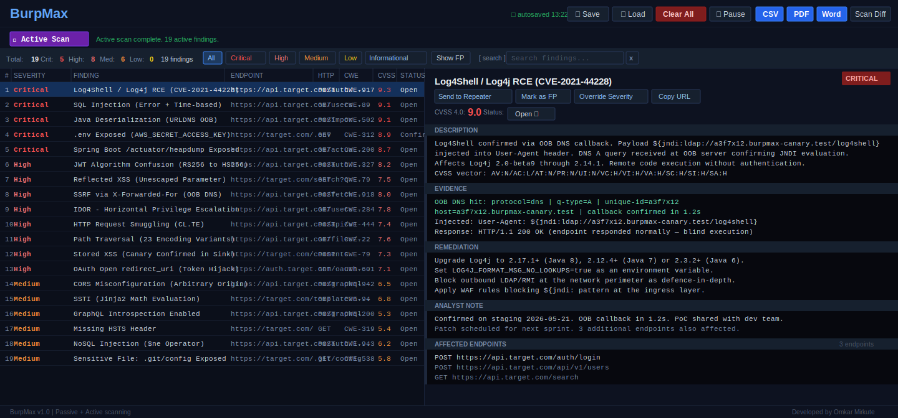

<div align="center">


# BurpMax

### Professional-Grade Active and Passive Vulnerability Scanner for Burp Suite

**Bringing Burp Suite Professional scanning capabilities to every security tester, including Community Edition users.**

<br/>

[](https://adoptium.net/)
[](https://portswigger.net/burp)
[](https://github.com/omkar-mirkute/burpmax/releases)
[](LICENSE)
[](#active-scanner--29-probes)
[](#passive-scanner--13-checkers)
[](https://github.com/omkar-mirkute)

<br/>

[**Installation**](#installation) • [**BurpMax vs Burp Pro**](#burpmax-vs-burp-suite-professional) • [**Usage**](#usage) • [**Features**](#features) • [**Active Scan Flow**](#active-scan-flow) • [**Security Design**](#security-design) • [**Disclaimer**](#disclaimer)

</div>

---

## What is BurpMax?

BurpMax is a feature-rich Burp Suite extension that delivers automated active and passive vulnerability scanning, OOB detection, WAF evasion, authenticated scanning with session health monitoring, CVSS 4.0 scoring, scan checkpointing, smart crawling with stack fingerprinting, and professional PDF/DOCX/CSV report generation. These are capabilities that are either locked behind Burp Professional or require multiple separate tools.

BurpMax gives Burp Community Edition users access to Pro-grade scanning features including automated active scanning with 29 probes, out-of-band interaction tracking via Interactsh, scan checkpointing with resume, professional PDF/DOCX reports with CVSS 4.0 and PoC screenshots, and more, at no extra cost.



---

## Installation

### Requirements

| Requirement | Minimum |
|---|---|
| Burp Suite | Community or Professional 2022.8+ |
| Java Runtime | 17+ (JRE is sufficient; JDK required only for building from source) |

### Option A - Pre-built JAR (Recommended)

1. Download `burpmax-1.0.0.jar` from the [**Releases**](../../releases) page
2. Open Burp Suite
3. Go to **Extensions** tab in the top navigation
4. Click the **Add** button
5. Set **Extension Type** to `Java`
6. Click **Select file** and choose the downloaded `burpmax-1.0.0.jar`
7. Click **Next**
8. The **BurpMax** tab appears in Burp's top navigation bar
9. Click the **BurpMax** tab to open the extension

### Option B - Build from Source

```bash
git clone https://github.com/omkar-mirkute/burpmax
cd burpmax
./build.sh
# Output: build/burpmax-1.0.0.jar
```

Then follow steps 2-9 from Option A using the built JAR at `build/burpmax-1.0.0.jar`.

The build uses local Burp API stubs for compilation. Stubs are **not** bundled in the output JAR. Burp Suite provides the real API classes at runtime.

---

## BurpMax vs Burp Suite Professional

Burp Suite Professional costs **$449/year** per licence. BurpMax is free and open source. Here is an honest side-by-side of what you get with each.

| Capability | BurpMax (Free) | Burp Suite Pro ($449/yr) |
|---|:---:|:---:|
| **Scanning** | | |
| Automated active scanning | Yes - 29 probes | Yes - proprietary scanner |
| Passive scanning | Yes - 13 checkers, real-time | Yes |
| WAF evasion encoding variants | Yes - 30+ per probe | Limited |
| Per-probe scan policy control | Yes | No |
| Scan checkpoints + resume | Yes | No |
| Right-click single-target scan | Yes | Yes |
| **OOB Detection** | | |
| OOB via Interactsh (free) | Yes | No |
| OOB via Burp Collaborator | No | Yes |
| Blind SQLi OOB | Yes (Interactsh) | Yes (Collaborator) |
| Blind CMDi OOB | Yes (Interactsh) | Yes (Collaborator) |
| Log4Shell DNS callback | Yes (Interactsh) | Yes (Collaborator) |
| XXE OOB | Yes (Interactsh) | Yes (Collaborator) |
| **Authentication** | | |
| Static token injection | Yes | Manual only |
| Login replay + auto re-auth | Yes | No |
| Session health monitoring | Yes | No |
| **Discovery** | | |
| Smart crawler with stack fingerprinting | Yes - 16 tech stacks | Basic |
| Sensitive file sweep | Yes - 17 curated paths | No |
| Hidden parameter discovery | Yes - 120-entry wordlist | No |
| Link extraction from JS/HAL/sitemap | Yes | Basic |
| **Findings and Workflow** | | |
| CVSS 4.0 scoring (auto + override) | Yes | CVSS 3.x only |
| PoC screenshots in reports | Yes - auto-generated | No |
| Analyst notes per finding | Yes | No |
| Remediation status tracking | Yes - 5 statuses | No |
| False positive suppression | Yes | Yes |
| Scan Diff (baseline comparison) | Yes | No |
| **Reporting** | | |
| PDF export with cover page | Yes | No (requires Burp Reporting, extra cost) |
| DOCX export | Yes | No |
| CSV export (JIRA/Dradis ready) | Yes | Yes |
| Formula-injection safe CSV | Yes | Unknown |
| **Infrastructure** | | |
| Price | Free, open source | $449/year |
| Works on Community Edition | Yes | N/A |
| Source code available | Yes - MIT licence | No |
| Burp Repeater integration | Yes | Yes |
| Burp site map integration | Yes | Yes |

> **Summary:** BurpMax covers all major vulnerability classes with 29 probes, delivers professional-quality PDF/DOCX reports with PoC screenshots and CVSS 4.0, supports authenticated scanning with auto re-auth, and provides OOB detection via Interactsh at zero cost. The only capability exclusive to Burp Pro is Burp Collaborator integration and its proprietary scanner engine. For most engagements BurpMax on Community Edition delivers equivalent or greater coverage at no licence cost.

---

## Usage

### The BurpMax Tab Layout

After loading the extension, click the **BurpMax** tab in Burp's top navigation. The interface has three main areas:

**Top toolbar (left side)**
- **Active Scan** button - starts a full active scan of all in-scope endpoints
- Progress bar - shows `completed/total | CurrentProbeName` during an active scan
- Scan status label - shows interrupted scan notices and scan completion messages

**Top toolbar (right side)**
- **Save** - save current findings to a session file
- **Load** - load a previously saved session file
- **Clear All** - delete all current findings (asks for confirmation)
- **Pause / Resume** - pause and resume passive scanning
- **CSV** - export findings to CSV
- **PDF** - export findings to a PDF pentest report
- **Word** - export findings to a DOCX pentest report
- **Scan Diff** - compare current findings against a saved baseline session

**Middle area - Findings table**
- Severity filter buttons: **All / Critical / High / Medium / Low / Info** (click to filter)
- **Show FP** toggle - show or hide suppressed false positive findings
- Search box - type to filter findings by name, host, URL, CWE, evidence, description, or analyst notes
- Findings table with columns: No. / Severity / Finding / Endpoint / HTTP / CWE / CVSS / Status

**Bottom area - Finding detail pane** (shown when a finding is selected)
- Finding name and severity badge
- CVSS 4.0 score and vector
- Remediation status dropdown (Open / Confirmed / Remediated / Accepted Risk / False Positive)
- Description, Evidence, Remediation text areas
- Analyst Notes text area (auto-saves as you type)
- Affected endpoints list
- **Send to Repeater** - open the original captured request in Burp Repeater
- **Mark as FP** / **Unmark FP** - suppress or un-suppress the finding
- **Override Severity** - change the finding severity from the original
- **Copy URL** - copy the finding URL to clipboard

---

### Passive Scanning

Passive scanning runs automatically as soon as BurpMax loads. There is nothing to configure or start.

1. Make sure BurpMax is loaded (the BurpMax tab is visible in Burp)
2. Browse your target application normally through Burp proxy
3. Every HTTP response flowing through Burp is analysed by all 13 passive checkers
4. New findings appear in the BurpMax findings table in real time
5. Click any finding row to see full details, evidence, and remediation in the bottom pane

Passive scanning covers: security header misconfigs, cookie flags, secrets and API keys in responses, version disclosure, cleartext credentials, HTML comment leaks, API response PII, cache control issues, and more. See the full list in the [Passive Scanner section](#passive-scanner--13-checkers).

---

### Active Scanning - Full Scope Scan

The full active scan runs all 29 probes against every in-scope endpoint collected from Burp's site map.

**Step 1 - Set your target scope**

Before scanning, define what Burp should consider in scope:
1. Go to **Target** tab in Burp
2. Click **Scope** sub-tab
3. Click **Add** and enter your target (e.g. `https://target.com`)
4. Click **Yes** when Burp asks if you want to stop sending out-of-scope items to proxy history

**Step 2 - Browse the target**

BurpMax collects endpoints from Burp's site map, so the more you have browsed, the more endpoints get scanned:
1. Go to **Proxy** tab and ensure **Intercept is off**
2. Open your browser (or use Burp's built-in browser)
3. Browse through your target application, visit key pages, submit forms, log in, navigate menus
4. Check **Target -> Site map** to confirm your target's URLs are appearing

**Step 3 - (Optional) Configure OOB backend**

OOB probes (Log4Shell, Blind SQLi, Blind CMDi, XXE OOB, SSRF, Java Deserialization) require an OOB backend to report callbacks. Skip this step if you only need non-OOB detection.

For Community Edition (free):
1. Click **Active Scan** in the BurpMax toolbar
2. In the scan dialog, find the **OOB** toggle and enable it
3. Select `interactsh (oast.pro - public)` from the dropdown for a zero-config public server
4. Or select `interactsh (self-hosted)` and paste your own Interactsh server URL
5. The OOB toggle must be switched on (green) for OOB probes to fire

For Burp Pro users:
- Select `Burp Collaborator` from the OOB backend dropdown

**Step 4 - (Optional) Configure authenticated scanning**

Skip this step if your target does not require authentication.

1. Click **Active Scan** in the BurpMax toolbar
2. Find the **Auth** section and tick the **Authenticated scan** checkbox
3. Choose the auth mode:
   - **Static token**: paste a Bearer token value or a full session Cookie header value into the token field, and set the header name (default: `Authorization`)
   - **Login replay**: paste the complete raw HTTP login request into the request box, and write a regex with a capture group to extract the token (e.g. `"access_token"\s*:\s*"([^"]+)"`)
4. (Optional) Enter a **Health Check URL** - BurpMax will GET this URL every 60 seconds and re-authenticate automatically if the session expires
5. The auth section must be expanded and the checkbox ticked for auth to take effect

**Step 5 - (Optional) Configure scan policy**

Disable specific probes you do not need for this engagement:
1. Click **Active Scan** in the BurpMax toolbar
2. Tick the **Scan policy (disable probes)** checkbox to expand the probe list
3. Uncheck any probes you want to skip (e.g. uncheck **SQLi** if the target uses NoSQL only)
4. Unchecked probes are skipped for every endpoint in this scan

**Step 6 - (Optional) Set request delay**

Adjust the delay between probe requests to avoid triggering WAF rate limiting:
1. In the scan dialog, use the **Delay** slider
2. Default is 150ms - increase for targets with aggressive rate limiting
3. Set to 0 for maximum speed on lab/CTF targets

**Step 7 - Start the scan**

1. Click **Active Scan** in the BurpMax toolbar (if the dialog is not already open from the steps above)
2. Review the configuration one last time
3. Click **Start scan**
4. Read the warning that active scanning sends additional HTTP requests to the target
5. Click **Yes** to confirm and start the scan

**Step 8 - Monitor progress**

While the scan runs:
- The progress bar shows `completed/total | ProbeName` - the number of endpoints done out of total, and the name of the probe currently executing
- The status label shows which endpoint is being scanned
- New findings appear in the table in real time as each probe confirms a vulnerability
- The toolbar shows an autosave timestamp (e.g. `autosaved 14:32`) every time findings are saved

**Step 9 - Resume an interrupted scan**

If Burp was closed or the scan was cancelled mid-way:
1. Click **Active Scan** again
2. A dialog appears: "Resume interrupted scan? X of Y endpoints remaining (Z% done)"
3. Click **Resume scan** to continue from where it left off
4. Click **Start fresh** to begin a completely new scan
5. Click **Cancel** to do nothing

**Step 10 - Cancel a running scan**

Click **Active Scan** again while a scan is running. The button becomes **Cancel Scan** during an active scan. Click it to stop. The checkpoint is preserved so you can resume later.

---

### Active Scanning - Single Request (Right-Click)

You can run all 29 active probes against a single specific request without running a full scan. This is useful for quickly testing one endpoint you found interesting.

**Method 1 - From Proxy History**

1. Go to **Proxy** tab in Burp
2. Click the **HTTP history** sub-tab
3. Find the request you want to test
4. Right-click the request row
5. A context menu appears - look for **Extensions** submenu, or the BurpMax option may appear directly
6. Click **Scan with BurpMax**
7. BurpMax starts a single-target scan on that request
8. Results appear in the BurpMax tab findings table

**Method 2 - From Repeater**

1. Go to **Repeater** tab in Burp (or send a request there first using Burp's Send to Repeater)
2. Right-click inside the **Request** panel
3. Click **Scan with BurpMax**
4. BurpMax runs all 29 probes against that exact request

**Method 3 - From Site Map**

1. Go to **Target** tab in Burp
2. Click the **Site map** sub-tab
3. Find the endpoint in the tree or table view
4. Right-click the endpoint row
5. Click **Scan with BurpMax**

**Multiple selection:** Hold Ctrl (or Cmd on Mac) and click multiple rows in Proxy History or Site Map, then right-click and choose **Scan with BurpMax**. BurpMax queues them and scans each one sequentially.

**What the right-click scan does:**
- Runs the full probe suite (all 29 probes, same as the full scan)
- Uses the same auth configuration and OOB backend as the last configured scan
- Includes the OOB poll phase (waits 30 seconds for DNS/HTTP callbacks after all probes finish)
- Skips the site map collection and link extraction phases
- Does not reset or affect any ongoing full scan session

---

### Sending Requests to BurpMax from Other Burp Tools

**From Burp Scanner (Pro):** Right-click any request in Burp's scan results and choose **Scan with BurpMax** to re-run BurpMax's probe suite on it.

**From Burp Intruder:** After running an Intruder attack, select a result request in the results table, right-click, and choose **Scan with BurpMax**.

**From Burp Decoder / Comparer:** BurpMax's right-click option is not available in Decoder or Comparer. Copy the request, paste it into Repeater first, then right-click in Repeater and choose **Scan with BurpMax**.

**From Burp Logger:** Right-click any entry in the Logger tab and choose **Scan with BurpMax** to probe that specific request.

---

### Finding Management

**Viewing a finding**

1. Click any row in the findings table
2. The bottom pane updates with full details: name, severity badge, CVSS score, description, evidence, remediation, affected endpoints
3. The analyst notes field is editable - type directly into it and notes save automatically as you type

**Filtering findings**

- Click **Critical**, **High**, **Medium**, **Low**, or **Info** buttons in the toolbar to filter by severity
- Click **All** to clear the severity filter
- Type in the search box to search across finding name, host, URL, CWE, evidence, description, and analyst notes
- Click the X button next to the search box to clear the search

**Suppressing false positives**

1. Click the finding row to select it
2. Click **Mark as FP** in the bottom button bar
3. The finding is suppressed from all exports (PDF, DOCX, CSV)
4. Click **Show FP** in the toolbar to make suppressed findings visible again
5. Select a suppressed finding and click **Unmark FP** to restore it

**Overriding severity**

1. Click the finding row to select it
2. Click **Override Severity** in the bottom button bar
3. A dialog shows severity options: Critical / High / Medium / Low / Informational / Remove Override
4. Click your choice
5. The finding severity updates immediately. Overridden severities are marked with an asterisk (*) in the table

**Setting remediation status**

1. Click the finding row to select it
2. Use the status dropdown in the bottom detail pane (shows: Open / Confirmed / Remediated / Accepted Risk / False Positive)
3. Click your chosen status - it saves immediately
4. Status is included in all exports

**Sending to Repeater**

1. Click the finding row to select it
2. Click **Send to Repeater** in the bottom button bar
3. The original captured request for that finding opens in Burp's Repeater tab
4. You can then modify and re-send it manually for further investigation

**Copying the URL**

1. Click the finding row to select it
2. Click **Copy URL** in the bottom button bar
3. The finding URL is copied to your clipboard

---

### Session Save and Load

**Saving a session**

1. Click **Save** in the toolbar
2. A file chooser dialog opens
3. Navigate to where you want to save and enter a filename (`.burpmax.json` extension recommended)
4. Click Save
5. BurpMax also **autosaves automatically every 2 seconds** after any new finding, writing to the same path atomically

**Loading a session**

1. Click **Load** in the toolbar
2. A file chooser dialog opens - select your `.burpmax.json` file
3. If findings already exist in the table, a dialog asks:
   - **Replace existing findings** - clears current findings and loads from file
   - **Merge with existing** - adds loaded findings to current ones, skipping duplicates
4. Click your choice
5. Loaded findings appear in the table

**Auto-restore on startup**

If BurpMax has a save path configured from a previous session, it automatically reloads that session file when the extension loads. You will see `Session restored: N findings` in the BurpMax log output.

---

### Report Export

**Exporting to PDF**

1. Click **PDF** in the toolbar
2. A report metadata dialog opens. Fill in:
   - **Client name** - appears on the cover page
   - **Scope** - assessment scope description
   - **Assessment date** - date range of the engagement
   - **Version** - report version (e.g. 1.0)
   - **Analyst name** - your name
   - **Classification** - e.g. CONFIDENTIAL
   - **Logo** (optional) - click Browse to select a PNG/JPG logo for the cover page
3. Click **Generate report**
4. A file chooser dialog opens - choose save location and filename
5. The PDF is written immediately

The PDF includes: cover page with severity badge summary and bar chart, table of contents, executive summary, vulnerabilities summary table, and per-finding detail pages with CVSS 4.0 score, PoC screenshot (side-by-side request/response with evidence highlighted), and remediation guidance. Suppressed (FP) findings are excluded.

**Exporting to DOCX**

1. Click **Word** in the toolbar
2. Fill in the same metadata dialog as PDF
3. Click **Generate report**
4. Choose save location
5. Open the `.docx` file in Microsoft Word or LibreOffice

The DOCX is generated as pure ZIP/XML (no external library required) and is compatible with all versions of Word.

**Exporting to CSV**

1. Click **CSV** in the toolbar
2. A file chooser dialog opens - choose save location
3. The CSV is written immediately

The CSV is sorted by severity (Critical first), includes all finding fields, is safe from formula injection (Excel/LibreOffice macro execution prevention), and is ready for import into JIRA or Dradis.

**Scan Diff export**

1. Click **Scan Diff** in the toolbar
2. A file chooser dialog opens - select a baseline session JSON file (a session saved from a previous scan of the same target)
3. BurpMax compares current findings against the baseline
4. A dialog shows: New findings (present now, absent before), Existing (present in both), Resolved (absent now, present before)
5. Choose **Export New as PDF** or **Export New as CSV** to export only the new findings
6. This is useful for re-test reports to show what was fixed and what is newly discovered

---

### OOB (Out-of-Band) Configuration for Community Edition

BurpMax supports Interactsh as a free OOB backend for Community Edition users, enabling OOB detection for Log4Shell, Blind SQL Injection, Blind Command Injection, XXE OOB, SSRF, Java Deserialization, and more.

**Using the public Interactsh server (easiest)**

1. Click **Active Scan** to open the scan dialog
2. Find the OOB section and enable the OOB toggle
3. Select `interactsh (oast.pro - public)` from the dropdown
4. Start the scan - no further configuration needed
5. After all probes finish, BurpMax waits 30 seconds for DNS/HTTP callbacks from the public server

**Using a self-hosted Interactsh server**

1. Deploy Interactsh: `docker run -it projectdiscovery/interactsh-server`
2. Note your server URL (e.g. `https://your-server.com`)
3. In BurpMax scan dialog, enable the OOB toggle
4. Select `interactsh (self-hosted)` from the dropdown
5. Paste your server URL into the field that appears
6. Start the scan

**Burp Collaborator (Pro users only)**

1. In the scan dialog OOB section, enable the OOB toggle
2. Select `Burp Collaborator` from the dropdown
3. BurpMax uses Burp's internal Collaborator API automatically

---

### Authenticated Scanning

**Static Token mode** - use this when you already have a valid session token:

1. Click **Active Scan** to open the scan dialog
2. Tick **Authenticated scan**
3. Select **Static token** from the mode dropdown
4. Enter the header name (default: `Authorization` - change to `Cookie` if using a session cookie)
5. Paste the full token value (e.g. `Bearer eyJhbGci...` for Authorization, or `session=abc123` for Cookie)
6. Click **Start scan**
7. Every probe request will have this header injected automatically

**Login Replay mode** - use this when you need BurpMax to log in automatically:

1. Go to **Proxy -> HTTP history** in Burp
2. Find the login request (the one that returns your session token)
3. Right-click it and choose **Copy to clipboard** (raw request) or note the request details
4. Click **Active Scan** in BurpMax
5. Tick **Authenticated scan**
6. Select **Login replay** from the mode dropdown
7. Paste the complete raw HTTP request into the **Login request** text area (include the full request line, headers, and body)
8. Write a regex in the **Token regex** field with one capture group to extract the token. Examples:
   - JSON body token: `"access_token"\s*:\s*"([^"]+)"`
   - Set-Cookie header: `session=([A-Za-z0-9]+)`
   - Custom header: `X-Auth-Token: ([^\r\n]+)`
9. Set the **Header name** to where the token should be injected (default: `Authorization`)
10. (Optional) Enter a **Health check URL** - a URL that returns 200 when the session is valid. BurpMax polls it every 60 seconds
11. Click **Start scan**
12. BurpMax logs in, extracts the token, and injects it into every probe request. On 401 it replays the login automatically

---

## Features

### Active Scanner - 29 Probes

Triggered manually via **Active Scan**. All injection probes support 30+ WAF evasion encoding variants per payload. Every finding requires confirmation (re-request or OOB callback) before being reported.

Probes are organized into four tiers by execution time. Fast probes (Tier 1) always complete before slow time-based probes (Tier 4) begin. Within each tier, probe order is shuffled for stealth.

#### Injection

| Probe | Tier | Detection Methods |
|---|---|---|
| **SQL Injection** | 3/4 | Error-based, Boolean-based, Time-based (sleep/benchmark), OOB DNS callback |
| **OS Command Injection** | 3/4 | Output-based (id/whoami), Time-based (sleep), OOB DNS/HTTP callback |
| **SSTI** | 2 | 8 engine-specific math payloads (Jinja2, Twig, Freemarker, Mako, Pebble, Velocity, Smarty, ERB) with baseline diff |
| **Blind SSTI** | 3 | OOB DNS callback via engine-specific RCE payloads |
| **XXE** | 2/3 | In-band file read (Linux/Windows paths) + OOB external entity DNS callback |
| **LDAP Injection** | 3 | Operator injection, OOB referral/JNDI DNS callback |
| **NoSQL Injection** | 2 | MongoDB operator injection ($gt, $ne, $where), regex injection, parameter pollution |
| **Path Traversal** | 2 | 23 encoding variants (standard, URL-encoded, double-encoded, overlong UTF-8, null-byte, semicolon) confirmed by file content signature |
| **Prototype Pollution** | 2 | `__proto__` and `constructor.prototype` injection in JSON body and URL params |
| **Blind Prototype Pollution** | 3 | OOB DNS callback via injected RCE gadget |
| **Java Deserialization** | 3 | URLDNS gadget chains for common libraries - OOB DNS confirmation only; no actual code execution |

#### Authentication and Session

| Probe | Tier | Detection Methods |
|---|---|---|
| **JWT Attacks** | 2 | alg=none (4 case variants), RS256 to HS256 algorithm confusion, weak HMAC secret brute-force, kid path injection, x5u OOB SSRF |
| **CSRF** | 1 | Missing token detection on state-changing (POST/PUT/DELETE) endpoints |
| **Auth Bypass** | 1 | Strip auth headers, dual-response similarity check |
| **IDOR** | 1 | Numeric ID increment in path/params, response diff analysis |
| **OAuth/OIDC** | 1 | Open redirect_uri, missing state parameter, implicit flow detection, missing PKCE on public clients, redirect_uri host-matching bypass, nonce absence |
| **ViewState Tampering** | 2/3 | MAC validation bypass (CRITICAL - RCE surface), ViewState encryption detection, OOB URLDNS confirmation |
| **Mass Assignment** | 2 | Inject undeclared fields (role, admin, price, is_active), read-back confirmation |
| **Race Condition** | 2 | 20 parallel requests (TOCTOU) confirmed by duplicate resource ID or state divergence |

#### Client-Side

| Probe | Tier | Detection Methods |
|---|---|---|
| **XSS (Reflected + DOM)** | 2 | Unique canary injection, unescaped reflection check; DOM XSS analyses response JS and runs on every endpoint including parameterless pages |
| **Stored XSS** | 2 | Canary injected into writable parameters, polled on same endpoint and sink pages harvested from Burp site map |

#### Infrastructure

| Probe | Tier | Detection Methods |
|---|---|---|
| **SSRF** | 3 | Parameter + header injection (X-Forwarded-For, Referer, Host), OOB DNS/HTTP callback |
| **Host Header Injection** | 1 | Canary hostname injection, reflection in body/redirect/Location header |
| **HTTP Request Smuggling** | 2 | CL.TE, TE.CL, TE-obfuscation; H2.CL and H2.TE on targets with HTTP/2 front-end indicators |
| **Log4Shell / Log4j RCE** | 3 | JNDI LDAP/DNS callback via OOB, injected into all headers and parameters |
| **Open Redirect** | 1 | Canary URL injection into redirect/return/next parameters |
| **CORS Misconfiguration** | 1 | Evil-origin probe (evil.burpmax-canary.test), ACAO/ACAC header analysis |
| **GraphQL** | 1 | Introspection detection, batch query abuse, alias flooding, depth limit bypass |

#### Discovery

| Probe | Tier | Detection Methods |
|---|---|---|
| **Sensitive Files** | 2 | 17 curated paths (.git/config, .env, web.config, wp-config.php.bak, .aws/credentials, backup.sql, etc.) confirmed by content signature, soft-404 filtered, one sweep per host |
| **Smart Crawler** | 2 | Stack fingerprinting + 500+ path generic wordlist + 16 stack-specific wordlists confirmed by content signature, soft-404 filtered, one sweep per host, capped at 120 requests |
| **Hidden Parameters** | 3 | 120-entry tiered wordlist (debug, admin, framework-specific, generic API params) with differential response analysis and non-determinism baseline check |
| **File Upload** | 2 | 10 bypass vectors (.php, .phtml, .jsp, double extension, trailing dot, URL-encoded extension, Content-Type mismatch, .htaccess injection, path traversal in filename, SVG XSS) confirmed by fetch-back; inert markers only, never real shells |

---

### Passive Scanner - 13 Checkers

Analyses every HTTP request/response through the Burp proxy. Zero extra requests sent. Runs automatically from the moment the extension loads.

| Checker | What It Finds |
|---|---|
| **HeaderChecker** | Missing HSTS, CSP, X-Frame-Options, Referrer-Policy, Permissions-Policy; CORS misconfigs |
| **CookieChecker** | Missing HttpOnly / Secure / SameSite flags; JWT or JSON stored in cookies |
| **BodyChecker** | Secrets and sensitive data patterns in response bodies |
| **HtmlChecker** | HTML comments with sensitive data, debug markers, directory listings, backup file references |
| **RequestChecker** | Dangerous HTTP method usage, overly permissive access-control headers |
| **VersionChecker** | 46 patterns across servers, libraries, CMS, and frameworks (Apache, Nginx, PHP, Spring, WordPress, etc.) |
| **SecretChecker** | AWS keys, GitHub/GitLab tokens, Google API keys, Stripe, Slack, HashiCorp Vault, private keys, DB connection strings (19+ patterns); matched secrets are partially masked before storage |
| **ApiResponseChecker** | PII fields, credential exposure, credit cards (Luhn-validated), SSN, stack traces, debug mode leaks |
| **CacheControlChecker** | Insecure Cache-Control on authenticated responses |
| **RateLimitChecker** | Missing rate limiting on auth endpoints (passive header detection + active 6-request verification) |
| **CloudMetadataChecker** | IMDS / 169.254.169.254 references in responses |
| **CleartextCredentialChecker** | Usernames/passwords in plaintext in request bodies or URLs |
| **MethodChecker** | Dangerous HTTP methods enabled (TRACE, PUT, DELETE) |

Passive scanning on active probe responses: after each probe, BurpMax also runs all 13 passive checkers against the probe's own response bytes. Secrets, version disclosures, and header misconfigs in error pages triggered by active probes are captured and tagged with "Detected in active probe response".

---

### Authenticated Scanning

BurpMax supports two authentication modes configured in the Auth panel before starting a scan:

| Mode | How It Works |
|---|---|
| **Static Token** | Paste a Bearer token or session cookie. Injected into every probe request automatically. On 401 a one-time warning is logged. |
| **Login Replay** | Provide a raw login request and a regex to extract the token from the response. BurpMax replays the login and re-authenticates automatically on 401 - serialized via ReentrantLock so only one thread re-auths while others wait for the fresh token. |

**Session Health Monitor:** When a health-check URL is configured, a background thread polls it every 60 seconds. On 401, 403, or a failed body pattern match, re-authentication is triggered proactively - re-auth happens before any probe sees a 401.

---

### Out-of-Band (OOB) Detection

BurpMax supports two OOB backends, automatically selected based on availability:

| Backend | Availability | Use Case |
|---|---|---|
| **Burp Collaborator** | Burp Suite Professional | Full integration via Burp's internal API |
| **Interactsh** | Community Edition | Free, open-source OOB platform. Enables OOB scanning on Community Edition. |

OOB probes: SQLi (DNS), OS Command Injection (DNS/HTTP), Blind SSTI (DNS), Blind Prototype Pollution (DNS), XXE (DNS), SSRF (DNS/HTTP), Log4Shell (DNS), Java Deserialization (DNS), JWT x5u (HTTP), ViewState (DNS).

Community Edition users can configure a public Interactsh instance (oast.pro) or a self-hosted server in BurpMax settings with no Burp Pro licence required.

---

### Smart Crawler and Link Extractor

BurpMax's crawler runs before the active scan to discover endpoints not yet in Burp's site map.

**Link Extractor** harvests from every response already in the site map:
- HTML href, src, action, formaction, data-url, data-href
- HTML forms - GET forms generate new GET targets; POST/PUT/DELETE forms queued as probe contexts
- JavaScript fetch(), axios, jQuery.ajax, XMLHttpRequest.open, require(), import()
- HAL / JSON-API _links.*.href and self.href
- robots.txt Disallow/Allow directives
- sitemap.xml loc tags (filtered to in-scope hosts)
- URL path parameters (normalised to avoid /user/1 vs /user/2 duplicates)
- HTML and JS comment URLs
- CSS url() references

**Smart Crawler Probe** (per-host, one sweep per scan, max 120 requests):

1. Fingerprints the stack from existing response headers, cookies, and body markers (no extra requests):
   - Server/X-Powered-By headers: Apache, Nginx, IIS, Tomcat/Jetty
   - Session cookies: PHP, Java EE, ASP.NET, Laravel, CodeIgniter, Django, Rails, Node.js
   - Body markers: WordPress, Drupal, Joomla, Laravel, Django, Rails, Spring Boot, Next.js, Jenkins, GitLab

2. Merges wordlists for all detected stacks (multiple stacks detected = all wordlists merged). 16 stack-specific wordlists:
   - Apache: mod_info, /icons/, /manual/
   - Nginx: nginx_status stub_status
   - IIS: trace.axd, elmah.axd, _vti_pvt/
   - Tomcat: /manager/html, /host-manager/html, /examples/servlets/, /examples/jsp/
   - PHP: info.php, phpMyAdmin, Adminer
   - WordPress: /wp-admin/, /wp-content/debug.log, /xmlrpc.php, REST API user enumeration
   - Drupal: /CHANGELOG.txt, sites/default/files/
   - Joomla: /administrator/, /configuration.php~
   - Laravel: /telescope, /horizon, /_ignition/execute-solution (CVE-2021-3129 surface)
   - Django: /admin/, /__debug__/, Django Debug Toolbar
   - Rails: /rails/info/routes, /rails/info/properties, /sidekiq
   - Spring Boot Actuator: /actuator/env, /actuator/heapdump, /actuator/configprops, /actuator/mappings, and more
   - Node.js: /.npmrc, /yarn.lock, /.next/
   - Jenkins: /manage, /script (Groovy console = RCE), /asynchPeople/
   - GitLab: /explore, /users/sign_up
   - Generic: 500+ paths covering backup archives, SQL dumps, env files, VCS dirs, CI/CD configs, container manifests, cloud credentials, IDE artefacts, lockfiles, private keys, keystores, API specs, SOAP/WSDL, database admin tools, admin consoles, login pages, install scripts, upload dirs, log files, monitoring dashboards

3. Sorts candidates by severity (Critical first) so highest-impact paths are always tested within the 120-request budget

4. Confirms every hit with a soft-404 baseline check, content signature match, and re-request

**Sensitive File Probe** (per-host, one sweep per scan, separate from Smart Crawler): 17 curated paths that are dangerous on any web server regardless of stack: .git/config, .git/HEAD, .env, .svn/entries, .DS_Store, web.config, .htaccess, composer.json, package.json, Dockerfile, docker-compose.yml, phpinfo.php, server-status, wp-config.php.bak, .aws/credentials, config.json, backup.sql.

---

### Report Generation

Export findings in four formats:

| Format | Description |
|---|---|
| **PDF** | A4 pentest report: cover page with client branding and severity badge summary, TOC, executive summary with severity bar chart, per-finding pages with CVSS 4.0 score and vector, PoC screenshots (side-by-side request/response with evidence highlighting), and remediation guidance |
| **DOCX** | Client-ready Word document: cover page, TOC, executive summary with severity chart, findings table, per-finding detail pages, remediation appendix |
| **CSV** | JIRA / Dradis compatible, sorted by severity, formula-injection safe (cells prefixed to prevent Excel macro execution) |
| **Scan Diff** | Compare current findings against a saved baseline session - surfaces New, Existing, and Resolved findings; exportable as PDF or CSV |

PoC Screenshots are automatically generated as side-by-side request/response image panels with red highlights on key evidence lines, styled to match Burp's UI.

CVSS 4.0 scores are auto-computed per finding via a prefix-matched lookup table and embedded in PDF/DOCX exports. Analysts can override individual scores via the UI.

---

### Session and Scan Management

| Feature | Details |
|---|---|
| **Autosave** | Findings saved every 2 seconds (debounced). Atomic Files.move(ATOMIC_MOVE) writes prevent corruption on crash. Falls back to REPLACE_EXISTING on filesystems that do not support atomic move. |
| **Scan Checkpoints** | After every completed endpoint the checkpoint is updated and persisted to Burp settings. On Burp restart or mid-scan interruption, clicking Active Scan presents a Resume dialog - allows resuming exactly where the scan left off without re-testing completed endpoints. |
| **Session Load** | Load a previous session JSON on startup or via the Load button. Choose Replace (clears current findings) or Merge (adds to existing). Max 50 MB file size enforced. |
| **Scan Diff** | Load a baseline session to identify what changed since the last assessment. |

---

## Active Scan Flow

Here is what happens from the moment you click **Active Scan**:

```
1. Auth initialisation (if configured)
   - STATIC mode: token stored immediately
   - LOGIN mode: login request replayed, token extracted via regex
   - Health monitor started if health URL configured

2. Collect targets from Burp site map
   - In-scope only, dedup by METHOD:URL
   - Skip static resources (.js, .css, .png, .woff, etc.)
   - Skip WebSocket / SSE / Socket.IO URLs
   - Parse query params, form body, JSON body (dot-notation flattened), XML body

3. Link extraction pass
   - Crawl existing responses for new URLs (HTML, JS, HAL, robots.txt, sitemap.xml)
   - Newly discovered endpoints appended to target list

4. Cap at 500 targets, shuffle for stealth

5. Create checkpoint (all URLs marked pending), persisted to Burp settings

6. Scan loop: 2 endpoints in parallel, max 4 concurrent requests per host
   For each endpoint:
   a. Probe filter: skip irrelevant probes per endpoint context
      (no params -> skip injection probes; GET -> skip CSRF; no JSON -> skip NoSQLi, etc.)
   b. Merge user scan policy exclusions
   c. Run probes in tier order (Tier 1 -> 2 -> 3 -> 4), shuffled within each tier
      Each probe has a 30-second wall-clock timeout
   d. After each probe: run all 13 passive checkers on probe response bytes
   e. Mark endpoint completed in checkpoint, persist

7. OOB poll phase (if OOB configured)
   - Wait 30 seconds for DNS/HTTP callbacks
   - Poll OOB backend, match interactions to probe injection IDs
   - Report OOB findings

8. Cleanup
   - Health monitor stopped
   - OOB client closed
   - Probe URL registry cleared
   - Checkpoint cleared (clean completion only; preserved on cancel/error for resume)
```

---

## Security Design

BurpMax is built to be safe to run in live engagements:

| Property | Implementation |
|---|---|
| No passive-to-active bleed | Active scanner uses makeHttpRequest() which does not fire IHttpListener. All probe URLs registered and filtered in passive scanner. |
| No false positives from probe traffic | Every probe request is registered; passive scanner skips all probe-generated URLs. |
| Confirmation required | Every active finding requires a re-request or OOB callback before being reported. No single-request findings. |
| Thread-safe finding store | FindingStore.add() is synchronized; listener notifications fire outside the lock to prevent deadlock. ConcurrentHashMap-backed family index. |
| Secret masking | Matched secrets are partially redacted (first 4 chars visible, rest ****) in evidence before storage or export. |
| XML injection prevention | All user/finding data passes through esc() before DOCX XML embedding. |
| Path canonicalization | All export file paths are canonicalized and checked for .. to prevent directory traversal. |
| Atomic session writes | Autosave uses Files.move(ATOMIC_MOVE). Partial writes on crash are impossible. |
| Active scan cap | Hard limit of 500 targets and 5,000 findings per scan session. |
| No network calls from passive scanner | IHttpListener observes proxy traffic only; the passive scanner never initiates a request. |
| Inert upload payloads | File upload probe uses unique marker bytes, never real web shells. Confirms via fetch-back only. |
| Log injection prevention | Finding names and endpoints are CRLF-stripped before writing to Burp's output console. |
| CSV formula injection prevention | CSV cells starting with =, +, -, @, |, or tab are prefixed with ' to prevent Excel/LibreOffice macro execution. |

---

## Project Structure

```
burpmax/
+-- src/main/java/com/burpmax/
|   +-- BurpExtender.java              # Extension entry point (IBurpExtender, IHttpListener,
|   |                                  # ITab, IExtensionStateListener, IContextMenuFactory)
|   +-- model/
|   |   +-- Finding.java               # Finding model + JSON serialisation + remediation statuses
|   |   +-- Cvss4Calculator.java       # CVSS 4.0 prefix-matched score + vector lookup
|   +-- store/
|   |   +-- FindingStore.java          # Thread-safe store, semantic dedup, 5000-finding cap
|   +-- scanner/                       # Passive checkers (13 total, zero extra requests)
|   |   +-- Dispatcher.java
|   |   +-- HeaderChecker.java
|   |   +-- CookieChecker.java
|   |   +-- BodyChecker.java
|   |   +-- HtmlChecker.java
|   |   +-- RequestChecker.java
|   |   +-- VersionChecker.java        # 46 version/tech fingerprint patterns
|   |   +-- SecretChecker.java         # 19+ secret patterns with partial masking
|   |   +-- ApiResponseChecker.java
|   |   +-- CacheControlChecker.java
|   |   +-- CloudMetadataChecker.java
|   |   +-- RateLimitChecker.java
|   |   +-- CleartextCredentialChecker.java
|   |   +-- MethodChecker.java
|   +-- active/                        # Active probe modules (29 probes)
|   |   +-- ActiveScanner.java         # Orchestrator: 4-tier ordering, per-host semaphore
|   |   +-- HttpSender.java            # Auth-injecting HTTP client, exponential backoff retry
|   |   +-- RequestBuilder.java        # Payload injection engine (query, body, JSON, XML, headers)
|   |   +-- WafEvasionEncoder.java     # SQL, XSS, CmdI variants (30+ per probe)
|   |   +-- ProbeContext.java          # Per-endpoint scan context
|   |   +-- ActiveScanResult.java      # Probe result with PoC request/response/timing data
|   |   +-- OobClient.java             # OOB interface (Collaborator / Interactsh)
|   |   +-- CollaboratorOobClient.java # Burp Collaborator backend (Pro only)
|   |   +-- InteractshOobClient.java   # Interactsh backend (Community Edition)
|   |   +-- ConfirmationEngine.java    # Error-based, time-based, and differential confirmation
|   |   +-- AuthConfig.java            # Static-token or login-replay auth configuration
|   |   +-- AuthManager.java           # Thread-safe re-auth on 401
|   |   +-- SessionHealthMonitor.java  # Polls health URL every 60s, triggers re-auth on expiry
|   |   +-- ScanCheckpoint.java        # Per-endpoint checkpoint for scan resume
|   |   +-- JsonWalker.java            # Lightweight JSON flattener and leaf-node injector
|   |   +-- XmlBodyParser.java         # XML body leaf-node flattener and injector
|   |   +-- LinkExtractor.java         # Multi-source endpoint discovery
|   |   +-- SqliProbe.java
|   |   +-- OobSqliProbe.java
|   |   +-- XssProbe.java
|   |   +-- StoredXssProbe.java
|   |   +-- CommandInjectionProbe.java
|   |   +-- BlindCmdiProbe.java
|   |   +-- SstiProbe.java
|   |   +-- BlindSstiProbe.java
|   |   +-- PathTraversalProbe.java
|   |   +-- XxeProbe.java
|   |   +-- LdapInjectionProbe.java
|   |   +-- NoSqlInjectionProbe.java
|   |   +-- PrototypePollutionProbe.java
|   |   +-- BlindPrototypePollutionProbe.java
|   |   +-- SsrfProbe.java
|   |   +-- JwtProbe.java
|   |   +-- GraphQlProbe.java
|   |   +-- HttpRequestSmugglingProbe.java
|   |   +-- CsrfProbe.java
|   |   +-- IdorProbe.java
|   |   +-- AuthBypassProbe.java
|   |   +-- CorsMisconfigProbe.java
|   |   +-- HostHeaderProbe.java
|   |   +-- OpenRedirectProbe.java
|   |   +-- Log4ShellProbe.java
|   |   +-- MassAssignmentProbe.java
|   |   +-- RaceConditionProbe.java
|   |   +-- OAuthOidcProbe.java
|   |   +-- FileUploadProbe.java
|   |   +-- ViewStateProbe.java
|   |   +-- JavaDeserializationProbe.java
|   |   +-- HiddenParamProbe.java
|   |   +-- SensitiveFileProbe.java
|   |   +-- SmartCrawlerProbe.java
|   +-- poc/
|   |   +-- PoCRenderer.java           # PoC screenshot generator (Java2D, 150 dpi)
|   +-- export/
|   |   +-- PdfExporter.java           # A4 PDF with CVSS 4.0 and PoC screenshots
|   |   +-- DocxExporter.java          # DOCX (pure ZIP/XML, no external libs)
|   |   +-- CsvExporter.java           # CSV (formula-injection safe, severity-sorted)
|   |   +-- ScanDiff.java              # Baseline comparison (New / Existing / Resolved)
|   |   +-- ReportMeta.java            # Report cover page metadata
|   +-- session/
|   |   +-- SessionManager.java        # Debounced autosave, ATOMIC_MOVE writes
|   +-- ui/
|       +-- UIBuilder.java             # Main Swing UI
|       +-- FindingTableModel.java     # JTable model for findings pane
|       +-- Theme.java                 # Colour/font constants
+-- burp-stub/                         # Burp API stubs (compile-time only, not in JAR)
+-- build/MANIFEST.MF
+-- build.sh                           # Build script (javac + jar, no Maven install required)
+-- pom.xml                            # Maven build (alternative to build.sh)
+-- LICENSE
+-- README.md
```

---

---

---

## Disclaimer

BurpMax is intended exclusively for use by security professionals on systems they are **explicitly authorised to test**. Unauthorised scanning or exploitation of systems you do not own, or for which you do not have written permission, is illegal under the Computer Fraud and Abuse Act (CFAA), the Computer Misuse Act (CMA), and equivalent laws worldwide.

The author and contributors accept no liability for misuse, damage, or legal consequences arising from the use of this tool.

---

## License

This project is licensed under the **MIT License**. See [LICENSE](LICENSE) for the full text.

---

<div align="center">

Developed by **Omkar Mirkute**

*If BurpMax saved you time on an engagement, consider leaving a star. It helps others find the tool.*

</div>
